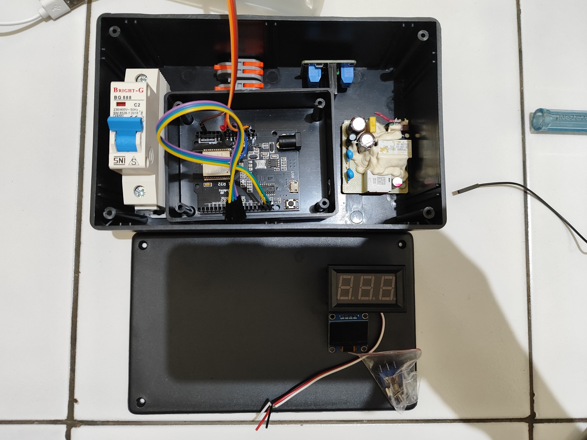
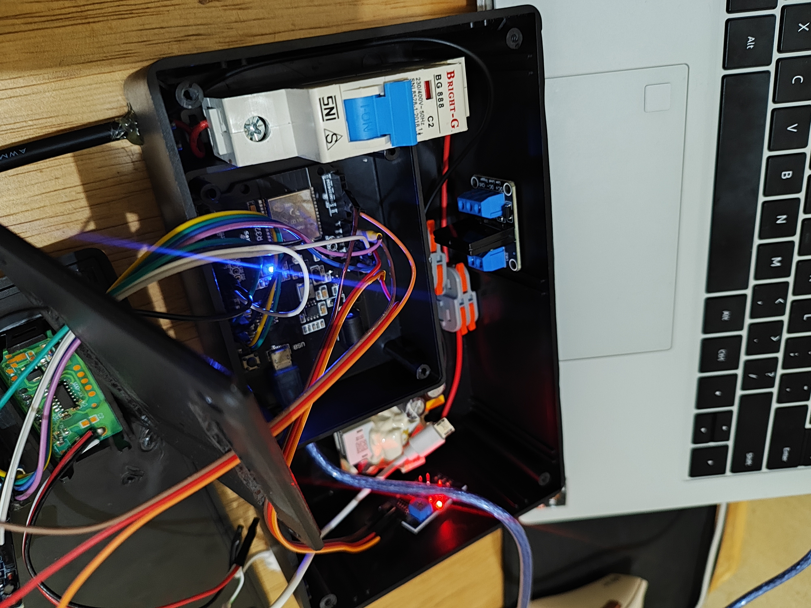
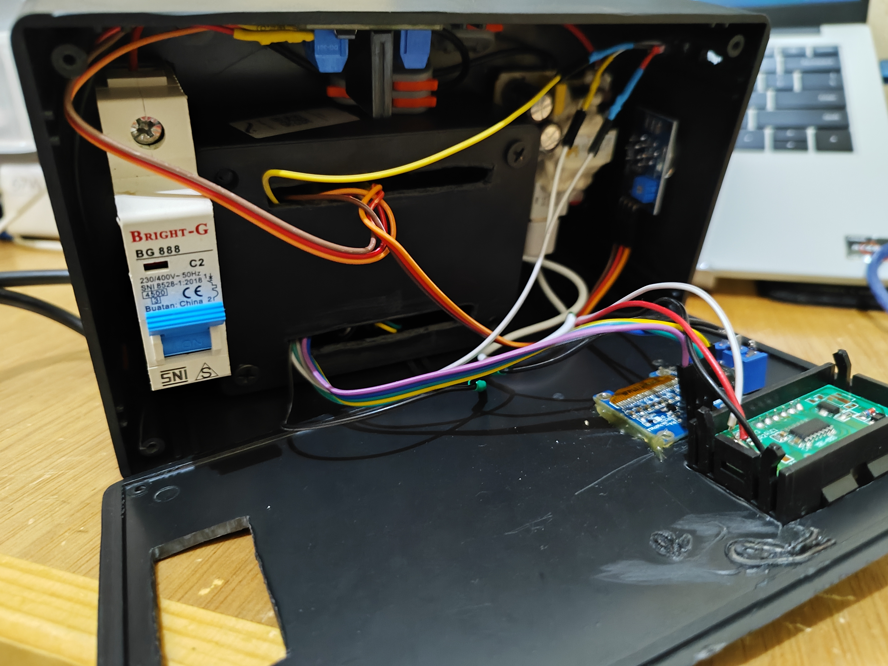
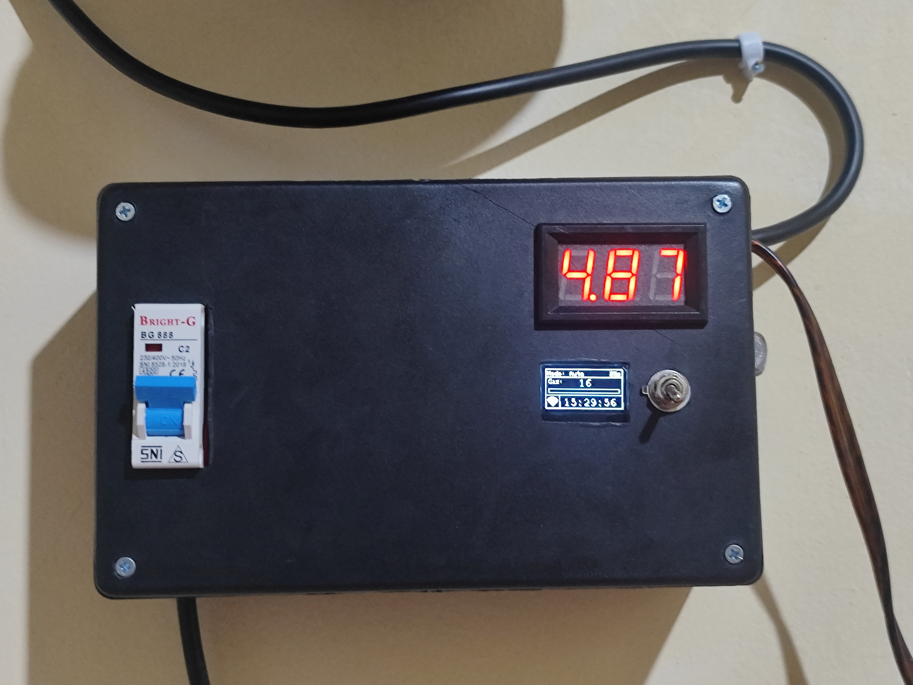

## My Project Gallery

Here are some projects I have done:

---

## Project 1: Compact Wifi and BLE Jammer by Emensta  

**Description:**  
This tool can jam with Bluetooth and WiFi.

  
  

**Technologies used:** ESP32 • RF Signal Testing • PCB Design

---

## Project 2: Cinemathe-Que (Personal Watch Tracker)

**Description:**  
A personal entertainment tracker website that helps users organize their watch activity by managing shows or movies they have watched, are currently watching, or plan to watch in the future.

  

**Preview:**  

  
  

---

## Project 3: Smart Kitchen Monitoring and Automation System

**Description:**  
An IoT-based smart kitchen monitoring system designed to detect LPG gas concentration, monitor temperature and humidity levels, and automatically control an exhaust fan when unsafe conditions are detected. The system is integrated with Blynk for real-time monitoring and Telegram for instant alert notifications.

  
  
  
  

**Features:**  
- LPG Gas Detection  
- Temperature and Humidity Monitoring  
- Automatic Exhaust Fan Control  
- Real-time Monitoring with Blynk  
- Instant Alert Notifications via Telegram Bot  

**Technologies used:** ESP32 • IoT System • Blynk • Telegram Bot API • Gas Sensor • Automation System

