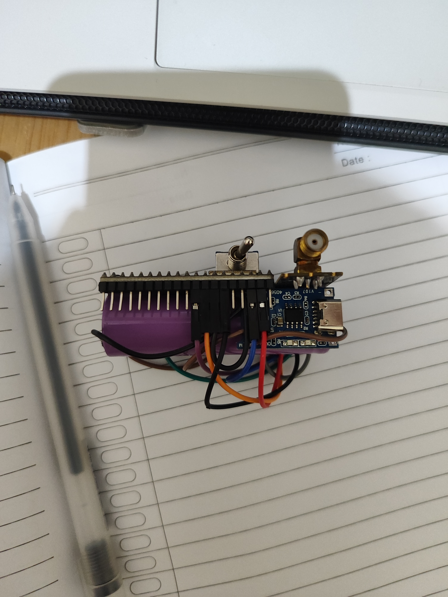
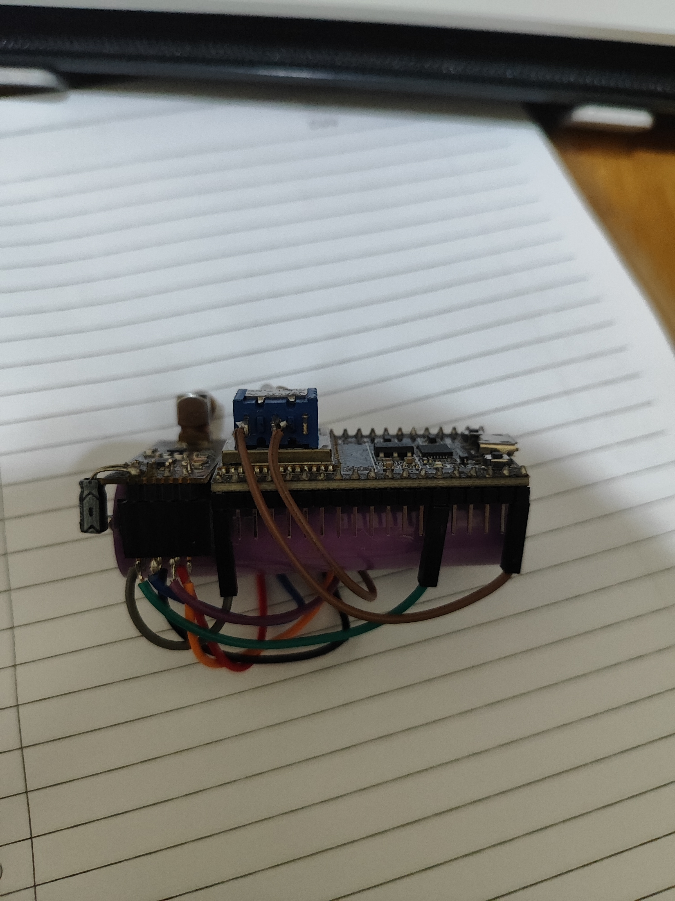
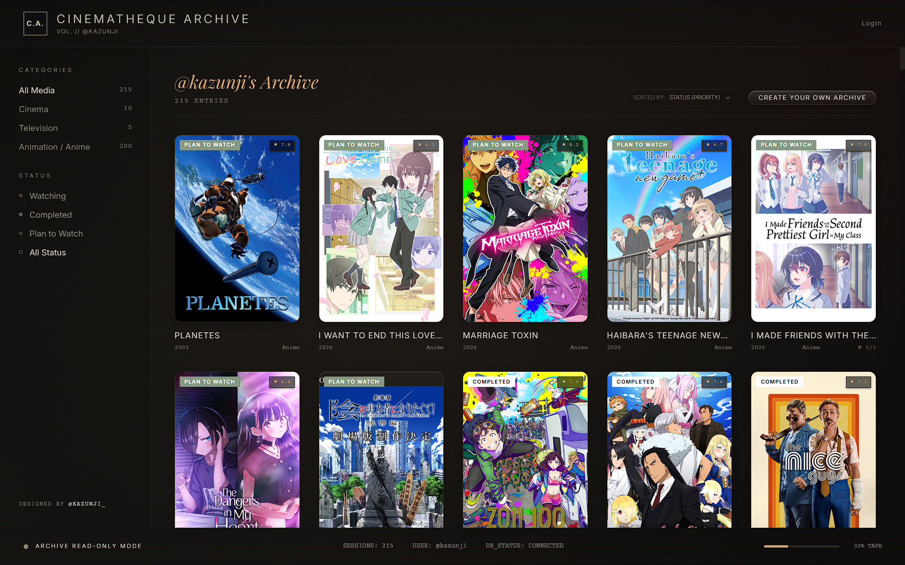
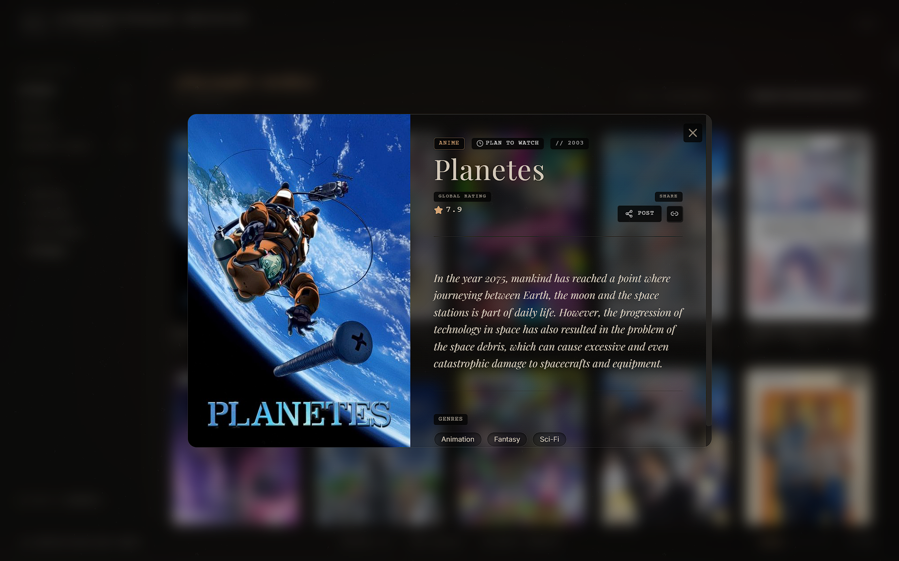

## My Project Gallery

Here are some projects I have done:

---

## Project 1: Compact Wifi and BLE Jammer by Emensta  

**Description:**  
This tool can jam with Bluetooth and WiFi.

  
  

**Technologies used:** ESP32 • RF Signal Testing • PCB Design

---

## Project 2: Cinemathe-Que (Personal Watch Tracker)

**Description:**  
A personal entertainment tracker website that helps users organize their watch activity by managing shows or movies they have watched, are currently watching, or plan to watch in the future.

  

**Preview:**  

  
  

